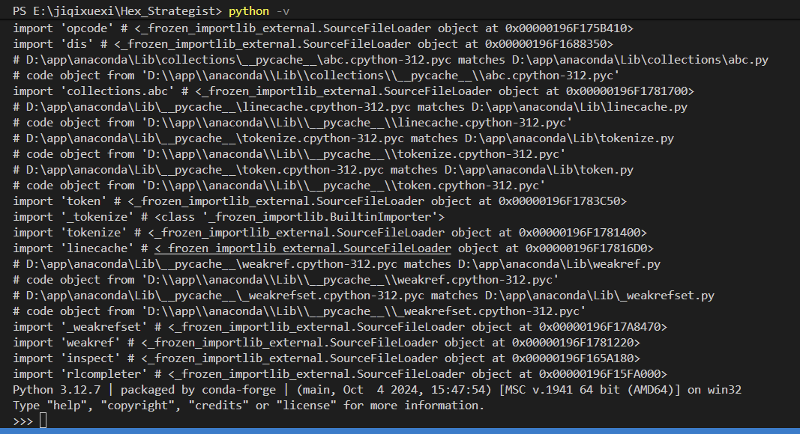
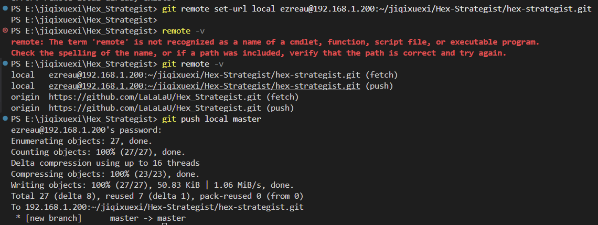
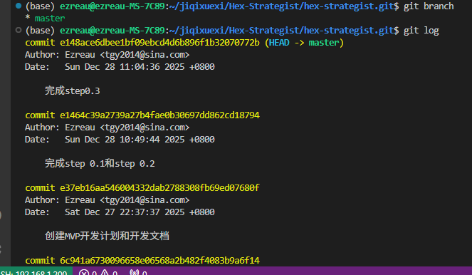
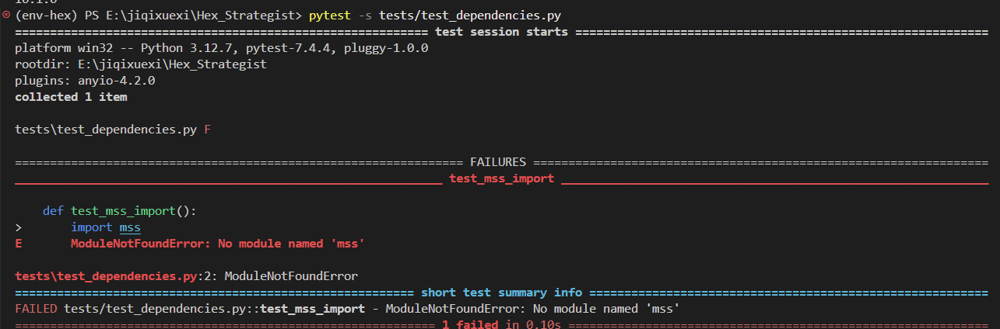
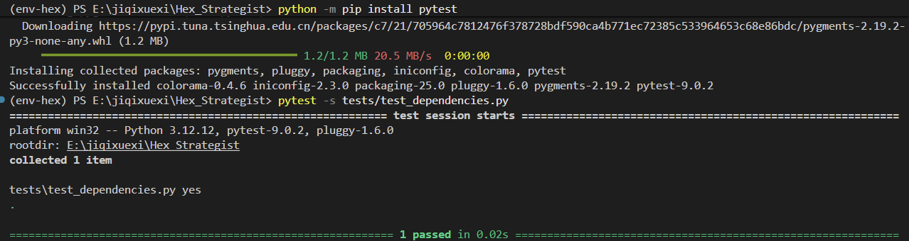
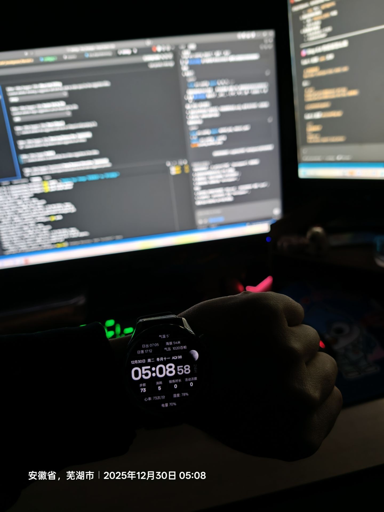
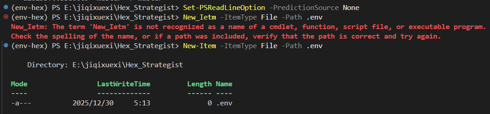
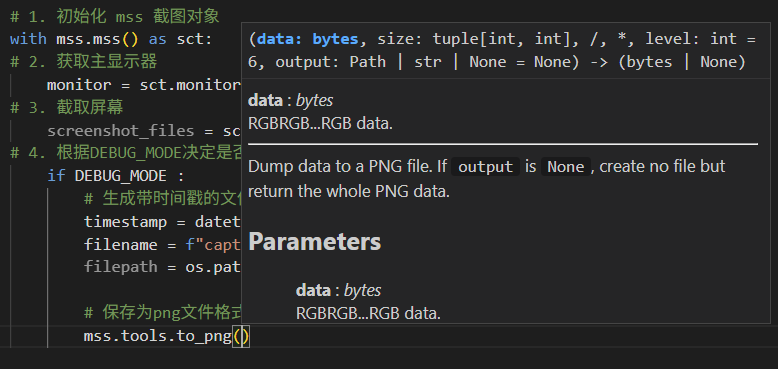

# Hex-Strategist MVP 开发日志

**项目名称**：Hex-Strategist
**开发模式**：测试驱动开发（TDD）
**开始日期**：2025-12-27
**目标完成**：2026-02-27（60天）

---

## 日志使用说明

### 记录原则
1. **每完成一个原子步骤**，就更新日志
2. **测试通过后**才标记为完成
3. **遇到问题**及时记录，包括解决方案
4. **每天结束**时，总结当天进度

### 状态标记
- ⏳ 进行中
- ✅ 已完成
- ❌ 失败/阻塞
- ⚠️ 需要返工

### 模板格式
```
## [日期] - [步骤编号] [步骤名称]

### 计划
- 要做什么

### 学习经验
- 学到了什么、遇到了什么问题

### 测试结果
- 测试命令：xxx
- 测试输出：xxx
- 是否通过：✅/❌

### 遇到的问题
- 问题描述
- 解决方案

### 时间记录
- 开始时间：XX:XX
- 结束时间：XX:XX
- 耗时：X小时

### Git 提交
- Commit ID：xxxxxxx
- Commit Message：xxx
```

---

# 开发记录

## 2025-12-27 - 项目启动

### 今日目标
- [ ] 完成开发计划文档
- [ ] 完成开发日志模板
- [ ] 完成 Git 快速指南


### 下一步计划
- 开始 Phase 0: 环境准备

---

## Phase 0: 环境准备

### [日期：2025.12.28（周日）] - Step 0.1 - 安装 Python 3.10+

#### 计划
按照 MVP_Development_Plan.md 的 Step 0.1 执行

#### 学习经验
>MSF1:实际操作时使用了python -v进入了详细模式，才知道python -v和python -V不一样，后者才是python --version (注意是两个--，因为写错过哈哈哈)，且因为python -v 进入python详细模式后会输出很多日志文件，打印每日导入模块的详细信息。这时候进入的python要输入exit()，或者按下CTRL+Z后再按enter键退出。

>MSF2:决定认真动手维护开发日志（本文件），而不是像之前那样靠ai写。发现自己一个问题：总是打错别字，键盘拼写需要练习。

>MSF3:学着写.md文件（专业名词叫markdown格式），问了ai才知道斜体的格式是*内容*，引用的格式是在这句话前面加一个>，只要不认为换行，就还算一句话。我选择用引用格式突出显示我自己的想法（备注有符号"MSF"），并在必要时候用*斜体*表示强调，每个想法下空一格。

>MSF4：学习了.gitkeep是如何用的，如何写.gitignore文件内容（注意：里面的目录斜杠是/,像Linux那样，而不是Windows的\）

>MSF5:一个电脑下可以安装很多python，每一个python有自己的pip包。当前使用pip --version输出的是pip 25.0.1 from D:\app\anaconda\Lib\site-packages\pip (python 3.12)表明它来自D:\app\anaconda的python，那么python是不是来自这个路径呢？仅仅使用python --version是看不出来的，①可以使用python -v刚刚的那个详细模式看具体的细节"D:\app\anaconda\Lib\encodings\...，最后行是Python 3.12.7 | packaged by conda-forge ..."。或者②使用 python -c "import sys; print(sys.executable)"打印当前python的路径。

#### 测试结果
```bash
# 测试命令
python --version
pip --version

# 输出结果
PS E:\jiqixuexi\Hex_Strategist> python --version
Python 3.12.7
PS E:\jiqixuexi\Hex_Strategist> pip --version                                                      pip 25.0.1 from D:\app\anaconda\Lib\site-packages\pip (python 3.12)

# 状态：✅ 通过 
```

#### 遇到的问题
<!-- 如果有问题，记录在这里 -->

#### 时间记录
- 开始：2025.12.28 9：00
- 结束：2025.12.28 10：26

---

### [2025.12.28（周日）] - Step 0.2 - 安装 Git 并配置

#### 计划


#### 学习经验
无问题

#### 测试结果
```bash
git --version
git config --global user.name
git config --global user.email

# 输出：
PS E:\jiqixuexi\Hex_Strategist> git --version
git version 2.48.1.windows.1
PS E:\jiqixuexi\Hex_Strategist> git config --global user.name
Ezreau
PS E:\jiqixuexi\Hex_Strategist> git config --global user.email
tgy2014@sina.com

#状态：✅ 通过
```

#### 时间记录
- 开始：2025.12.28 10：30
- 结束：2025.12.28 10：45

---

### [日期：2025.12.28（周日）] - Step 0.3 - 在 Ubuntu 服务器创建 Git 仓库

#### 计划


#### 学习经验
>MSF1：bare仓库就是裸仓库，只用来放代码，不在里面写代码。

>MSF2: 在vscode中打开两个窗口，一个用来本地Windows开发，一个ssh远程连接，只需要点击文件-新窗口就可以了。

#### 测试结果
```bash
# 在服务器上运行
ls ~/projects/hex-strategist.git/
#输出：
(base) ezreau@ezreau-MS-7C89:~/jiqixuexi/Hex_Strategist$ git init --bare hex-strategist.git
hint: Using 'master' as the name for the initial branch. This default branch name
hint: is subject to change. To configure the initial branch name to use in all
hint: of your new repositories, which will suppress this warning, call:
hint: 
hint:   git config --global init.defaultBranch <name>
hint: 
hint: Names commonly chosen instead of 'master' are 'main', 'trunk' and
hint: 'development'. The just-created branch can be renamed via this command:
hint: 
hint:   git branch -m <name>
Initialized empty Git repository in /home/ezreau/jiqixuexi/Hex_Strategist/hex-strategist.git/
# 状态：✅ 通过
```


---

### [日期：2025.12.28（周日）] - Step 0.4 - Windows 克隆仓库并初始化项目结构

#### 计划


#### 学习经验
MSF1:在自己本地服务器192.168.1.200上配置远程仓库，需要先cd到建立仓库的地方，然后再建立一个bare仓库（git init --bare hex-strategist.gi）,然后再在Windows开发电脑上配置仓库位置（git remote set-url local ezreau@192.168.1.200:~/jiqixuexi/Hex-Strategist/hex-strategist.git注意这里用local因为origin已经被GitHub占用了，否则会报错rror: remote origin already exists.），最终配置好后，执行git push local master，就成功上传代码，如下图




#### 测试结果
```bash
tree /F
git status

#输出：
PS E:\jiqixuexi\Hex_Strategist> tree /f
卷 新加卷 的文件夹 PATH 列表
卷序列号为 887A-A373
E:.
│  .gitignore
│  README.md
│  requirements.txt
│
├─assets
├─docs
│  │  Development_Log.md
│  │  Git_Quick_Guide.md
│  │  MVP_Development_Plan.md
│  │  Project_Hex_Strategist_Whitepaper.md
│  │
│  └─images
│      └─dev_log
│              .gitkeep
│              step0.1-1.png
│              step0.4-1.png
│              step0.4-2.png
│
├─logs
├─output
├─src
└─tests

# 状态：✅ 通过

```

#### Git 提交
```bash
PS E:\jiqixuexi\Hex_Strategist> git add .
PS E:\jiqixuexi\Hex_Strategist> git commit -m "complete step 0.4" 
[master 5e0284e] complete step 0.4
 2 files changed, 5 insertions(+), 2 deletions(-)
 delete mode 100644 tests/test_
PS E:\jiqixuexi\Hex_Strategist> git push
Enumerating objects: 7, done.
Counting objects: 100% (7/7), done.
Delta compression using up to 16 threads
Compressing objects: 100% (4/4), done.
Writing objects: 100% (4/4), 852 bytes | 852.00 KiB/s, done.
Total 4 (delta 3), reused 0 (delta 0), pack-reused 0 (from 0)
remote: Resolving deltas: 100% (3/3), completed with 3 local objects.
To https://github.com/LaLaLaU/Hex_Strategist.git
   e148ace..5e0284e  master -> master
PS E:\jiqixuexi\Hex_Strategist> git push local master
ezreau@192.168.1.200's password: 
Enumerating objects: 7, done.
Counting objects: 100% (7/7), done.
Delta compression using up to 16 threads
Compressing objects: 100% (4/4), done.
Writing objects: 100% (4/4), 852 bytes | 852.00 KiB/s, done.
Total 4 (delta 3), reused 0 (delta 0), pack-reused 0 (from 0)
To 192.168.1.200:~/jiqixuexi/Hex-Strategist/hex-strategist.git
   e148ace..5e0284e  master -> master

# Commit ID：5e0284e
```

---

### [日期：2025.12.28（周日）] - Step 0.5 - 创建 Python 虚拟环境

#### 计划


#### 学习经验
>MSF1：实际上我并没有使用venv建立环境，而是使用conda,好处是将来可能用到更多的包（科学计算、C语言或其他语言的依赖）conda可以安装，而采用venv创建环境就只能通过pip安装python包。

>MSF2:如果使用python -m venv env-hex则会在项目目录中自动创建一个env-hex的环境文件夹，但是使用conda不会，conda的环境会统一放在D:\app\anaconda，即conda的安装位置。

>MSF3:理论上激活了环境后终端命令行前会有（env-hex）字样，但是刚开始没有，通过使用conda init powershell命令后再激活就显示了。

>MSF4：在conda中创建的env-hex环境不会在git push时上传，git push 只会跟踪在仓库目录里且被git add追踪的文件。

#### 测试结果
```bash
(base) PS E:\jiqixuexi\Hex_Strategist> conda activate env-hex
(env-hex) PS E:\jiqixuexi\Hex_Strategist> conda info --envs    

# conda environments:
#
base                   D:\app\anaconda
checkcheck             D:\app\anaconda\envs\checkcheck
env-hex              * D:\app\anaconda\envs\env-hex
shenduxuexi            D:\app\anaconda\envs\shenduxuexi
truthguard             D:\app\anaconda\envs\truthguard

(env-hex) PS E:\jiqixuexi\Hex_Strategist> 
# 状态：✅ 通过
```

---

### [日期：2025.12.28（周日）] - Step 0.6 - 安装基础依赖库

#### 计划


#### 学习经验
>MSF1:激活环境时，是conda activate env-hex 而不是activate conda env-hex(或者creativate!!!拼写错误)。

>MSF2:我采用了两种方法测试：
①直接写玩函数后调用，报错了，是因为我只是写了个函数，执行这个python文件时，python中并没有调用这个函数，所以得不到写的测试函数的print输出。因此在底下加上
if __name__ == "__main__":
    test_mss_import()
才算做调用，才能输出print。（如果想通过运行函数本身所在的文件看函数输出的话，if __name__ == "__main__" 就必须要有）
此外还要注意我的test_dependecies.py是在tests文件夹下的，所以命令要写 python .\tests\test_dependencies.py，而不是 python test_dependencies.py
②使用了pytest库：一开始发现电脑已经安装了pytest，兴冲冲使用 pytest -s tests/test_dependencies.py做测试，但是报错如下图折腾半天才知道原来这个已经有的pytest是别的项目的，不在PS E:\jiqixuexi\Hex_Strategist下，因此没法使用，需要重新安装，因此安装及安装后测试图如下：

>MSF3:第二个pillow库写测试文件时import pillow ，但是报错！原因发现安装库时这玩意儿叫做pillow，但是在程序中导入时这个库竟然叫做from PIL import Image，这是基于一定的历史渊源导致的。
#### 测试结果
```bash
python tests/test_dependencies.py

# 输出：
(env-hex) PS E:\jiqixuexi\Hex_Strategist> pytest .\tests\test_dependencies.py     
========================================================== test session starts ==========================================================
platform win32 -- Python 3.12.12, pytest-9.0.2, pluggy-1.6.0
rootdir: E:\jiqixuexi\Hex_Strategist
plugins: anyio-4.12.0
collected 5 items                                                                                                                        

tests\test_dependencies.py .....                                                                                                   [100%]

=========================================================== 5 passed in 6.31s =========================================================== 
(env-hex) PS E:\jiqixuexi\Hex_Strategist> pytest -s .\tests\test_dependencies.py 
========================================================== test session starts ==========================================================
platform win32 -- Python 3.12.12, pytest-9.0.2, pluggy-1.6.0
rootdir: E:\jiqixuexi\Hex_Strategist
plugins: anyio-4.12.0
collected 5 items                                                                                                                         

tests\test_dependencies.py ✅ mss 导入成功
.✅ pillow 导入成功
.Checking connectivity to the model hosters, this may take a while. To bypass this check, set `DISABLE_MODEL_SOURCE_CHECK` to `True`.
✅ paddleocr 导入成功
.✅ imagehash 导入成功
.✅ keyboard 导入成功

# 状态：✅ 通过
```

#### 遇到的问题


#### Git 提交
```bash
git commit -m "Add dependency test and requirements"
# Commit ID：d26193f
```

---

### [日期：2025.12.28（周日）] - Step 0.7 - 配置 VSCode（可选）

#### 是否执行
- [√ ] 是，已配置
- [ ] 否，跳过

>MSF1:安装了这个微软官方的python插件后，vscode右下角就会有Python 3.x 这种按钮，点击可以直接选择激活的环境。
---

### [日期：2025.12.30（周二早）] - Step 0.8 - 创建配置文件模板

#### 学习经验
>MSF1：昨天12.29下班吃饭整理完毕后21：30分，整个人状态不佳，选择早早洗漱睡觉，22：40入眠。在12.30一早5点就起床开始学习代码，这样的话到7点40出门上班有2个多小时的学习时间。最佳的状态，留给最爱的事业。

>MSF2:为了进一步精进练习代码命令，我把vscode的编辑区和终端的输入提示都关闭了。其中编辑区通过设置搜索inline suggest选择第五项，终端通过输入Set-PSReadLineOption -PredictionSource None实现本次终端提示关闭。

>MSF3:在通过命令行创建新文件的时候，New-Item -ItemType File -Path .env意为在当前工作目录中，新建一个名为 .env 的空文件，不要写成 New_Ietm -ItemType File -Path .env（注意下划线）

>MSF4:变量名的名称不是死的，但是遵循以下规范（PEP 8 python官方规范）：①常量名用 全大写+下划线。②普通变量名用 全小写+下划线。③类名称用 驼峰写法。④函数名用 全小写+下划线。

>MSF5:引入os、dotenv库 →→ load_dotenv()读取环境变量存放的文件env →→ GEMINI_API_KEY= os.getenv("GEMINI_API_KEY")再从环境变量里拿取并赋值(这里注意拼写，我在敲代码时一度把getenv敲成了dotenv)，以上是一整套获取环境变量的方法，这样实现真正的KEY值藏在另一个文件且不耽误调用使用。其中os.getenv（）支持两个变量，前面是要查找的，后面是找不到默认的。

>MSF6:所谓防御式编程就是在问题产生前提前确认和解决，if LLM_PROVIDER == "gemini" and not GEMINI_API_KEY:
    raise ValueError("缺少GEMINI_API_KEY请再.env文件配置")
    就是为了避免在实际运行工程时才发现缺少API_KEY，于是在配置文件中就通过条件限定的方式确认确实填入了API_KEY，因为配置文件src.config.py在主程序头会被引用，因此在引用时就会报错退出程序运行（因为引用模块的语句，import src.config虽然就一句话，但是系统会在后台通跑一边这个模块）。拼写上注意① "gemini"的引号不能少，因为gemini要作为一个字符串进行比对，不加引号则视为变量。② if条件后面的冒号:不能少。

>MSF7:路径配置方法为先用os.path.dirname()找到根目录PROJECT_ROOT的绝对路径，然后再使用os.path.join()拼接PROJECT_ROOT和output、assets等目录，得出output、assets这些目录的绝对路径。这样的好处有① 文件保存地址更改时只需要改一个os.path.join()的参数，而不用把所有用到这个目录路径的地方全都改了。 ② 队友协作时不同人的电脑上都可以找到每人电脑上自己的跟目录。③ os.path.join()本质是拼接目录，不管你用的是Windows的\还是Linux的/，此外拼写上注意获取绝对路径的函数叫os.path.abspath()，而不是os.path.obspath()！

>MSF8:在配置文件这里设置个DEBUG_MODE是为了在代码开发时配置一个“详细模式”，后续的代码会判断我们是否处于这个详细模式，如果是的，则会输出很多过程信息用于更充分信息的开发。将来项目完成，面向用户则可关闭改模式，过程中的日志，截图都不需要生成和显示，提高运行效率且保护隐私。


#### 测试结果
```bash
(env-hex) PS E:\jiqixuexi\Hex_Strategist> python -c "from src.config import *; print('PROJECT_ROOT:', PROJECT_ROOT); print('HEX_ICONS_DIR:', HEX_ICONS_DIR)"
PROJECT_ROOT: E:\jiqixuexi\Hex_Strategist
HEX_ICONS_DIR: E:\jiqixuexi\Hex_Strategist\assets\hex_icons

# 状态：✅ 通过
```

#### Git 提交
```bash
git commit -m "completed step0.8"
# Commit ID：0b6ce05
```

---

### [日期：2026.1.2] - Step 0.9 - 配置 pyproject.toml（后加）

### 情况说明
>MSF1:因为在step1.1测试环节中，因test.capture.py中import src.capture import capture_fullscreen，用到了其他根目录中其他文件夹(src)下的文件，但系统无法识别src，因此有两种方法：
    1，在文件中import sys 然后再用sys.path.insert(0, os.path.dirname(os.path.dirname(os.path.abspath(__file__))))把目录加进来让系统找到这个文件夹。
    2，使用pyproject.toml配置路径。
第一种方法简单快捷，用于快速测试代码是否有问题，（实际上也是这样做的）测试通过，但是这种方法最大问题在于其他python文件每一个只要引入src的文件就需要再最头上加上这两句，麻烦。于是就在测试成功后采用了第二种方法，这种方法通过配置[tool.setuptools.packages.find]写入
where = ["."]
include = ["src*"]
然后再 python -m install -e . 作用是将整个项目以可编辑安装加进了hex-env环境，于是所有src开头的引用都能被检索到（前提条件是src文件夹下有__init__.py文件），最后经过实测这种方式配置后删除import sys和sys.path.insert(0, os.path.dirname(os.path.dirname(os.path.abspath(__file__))))也可以运行test_capture.py不再报错


#### 测试结果
```bash
(env-hex) PS E:\jiqixuexi\Hex_Strategist> python -m pip install -e .
Looking in indexes: https://pypi.tuna.tsinghua.edu.cn/simple
Obtaining file:///E:/jiqixuexi/Hex_Strategist
  Installing build dependencies ... done
  Checking if build backend supports build_editable ... done
  Getting requirements to build editable ... done
  Preparing editable metadata (pyproject.toml) ... done
Building wheels for collected packages: hex-strategist
  Building editable for hex-strategist (pyproject.toml) ... done
  Created wheel for hex-strategist: filename=hex_strategist-0.0.0-0.editable-py3-none-any.whl size=3776 sha256=407182b5172a724916561420a2bfd23f9e36b788064e3cfcc2ae5a439886a6b1
  Stored in directory: C:\Users\tgy20\AppData\Local\Temp\pip-ephem-wheel-cache-_tbf_fcu\wheels\0e\1d\5c\783a8e52d42010d2a6f0f9d9c9a51f2fefedfd8a21b9ee9caa
Successfully built hex-strategist
Installing collected packages: hex-strategist
Successfully installed hex-strategist-0.0.0
# 状态：✅ 通过
```

---

## Phase 0 完成总结

### 完成日期
- 开始：2025.12.28
- 结束：2025.12.30

### 完成情况
- [✅] Step 0.1 ✅
- [✅] Step 0.2 ✅
- [✅] Step 0.3 ✅
- [✅] Step 0.4 ✅
- [✅] Step 0.5 ✅
- [✅] Step 0.6 ✅
- [✅] Step 0.7 ✅(可选)
- [✅] Step 0.8 ✅
- [✅] Step 0.9 ✅(后加)


### 下一步
开始 Phase 1: 感知层开发

---

## Phase 1: 感知层开发

### [日期：2026.1.2] - Step 1.1 - 实现基础截图功能
#### 学习经验
>MSF1:files = os.listdir(OUTPUT_DIR)这句话中的os.listdir()函数括号中放的是路径，整个函数得到的是名字（list列表格式），包含文件名和括号中路径的子目录名字。

>MSF2:第一次接触“列表推导式”语法：screenshot_files = [f for f in files if f.starstwith("capture_") and f.endswith(".png")]，表示对files中的每一个f([]中的第二个f)进行条件筛选，条件是文件名开头带着capture_并且文件名结尾带着.png，筛选后的f([]中的第二个f)返回，以f的样子([]中的第一个f，即没有改变f原来的样子，只是做了筛选)。它相当于
screenshot_files = []
for f in files:
    if f.startswith("capture_") and f.endswith(".png"):
        screenshot.files.append(f)
如果想要“变形后再放进去”，也可以，比如把文件名转成大写：
[f.upper() for f in files if f.startswith("capture_") and f.endswith(".png")]
此外，注意拼写：应该是 startswith 和 endswith，不是 startwith / endwith。

>MSF3:assert语句有两种用法，①就是直接后面跟条件，②是assert 条件,错误信息   中间用英文逗号分割开，可以理解为“如果条件不满足的话就报这个错误信息”。

>MSF4:在找到最新文件时用到了max()语句，并且比较的是完整的文件路径，但是路径明显不能比较大小，于是用到了key,其中key就是路径文件里要比较的东西，本例是key=os.path.getmtime（注意key后面跟函数名就可以了不用加()），就是这个路径的最新更改时间，用这个key来判断哪个路径是max

>MSF5:在python的官方风格指南PEP 8中指出，运算符+ - * / == > < and or等号两边要有空格，而调用等带关键字参数如key函数时，函数名两边不带空格。

>MSF6:原来以为import mss之后就可以用mss下的所有子模块，其实不对！import mss 之后还要import mss.tools把子模块加载进来才能用。当然单独引入mss.tools子模块也是可以的，但是习惯上不这么写，一般是写作from mss import tools ，拼写上注意这里不用再写作mss.tools，就直接tools。后续调用时，可直接使用tools.xxx而不是mss.tools.xxx

>MSF7：我知道这很奇怪，但是我还是想记录此刻我的想法：今天是元旦节2026年的1月1日，第一天，刚刚进行完家庭聚餐，喝了7两酒整个人脑袋晕晕，但我还是选择在结束后（此刻是20：35分）选择来学习项目，可能我编辑不了太多项目内容，但，我真的很想成功啊。算了，煽情无益，人若无名，专心练剑。

>MSF8:学习了with mss.mss() as sct调用资源的用法。
①：mss.mss不同于mss.tools，前者是调用mss下面的mss类并实例为sct（这个名字随便起），相当于把截图器打开，后者是调用子模块tools，虽然写法上都是在mss后面跟一个点.，但本质上他们不同。
②：with ... as ...的好处是截图器可以用完即时释放，不会因忘记释放而占用系统内存，如果用普通写法的话，前面sct = mss.mss()，后面就要用sct.close()结束，而结束这一步容易遗忘。用with用法则首尾一步到位。
③：sct.monitors[]不能写成mss.mss.monitors[1]，同样sct.grab()不能写成mss.mss.grab()，因为本质上monitors是实例sct的属性，grab是实例sct的方法。mss.mss是类，不是对象，而sct则是具体的对象，对象上才能带有属性和调用方法指向的目标。

>MSF9:关于我的疑惑“我有一个疑惑，我正在从零开始学习python，目前的方法是用AI生成代码以后我自己逐行手打并且问AI学习这个库、函数、类的意思以扩充知识面，但将来在我自己开发时，面对空白的编辑器（不再有AI 给我敲好程序）我根本不知道哪些库可以用到我的新项目中，世界上有那么多的库和模块，我该怎么学习呢”，codex如此答复：
你不需要“记住世界上所有库”，你只要记住“如何提问”。然后你会发现结果会反复出现同一批库，这批就是主流生态。“必修库”其实很少：建议你先建立一个核心栈。你现在从零学 Python，不要把目标定为“知道很多库”，而是：先建立 1 套你非常熟的核心栈，以后新需求就围绕它扩展。我建议你（结合你这个项目）优先熟这几类：
工程基础：pytest、日志（logging）、配置（os.getenv + .env）、路径（pathlib）
图像/屏幕：mss（截图）、Pillow 或 opencv（处理）
OCR：PaddleOCR
API：httpx 或 requests
结构化：dataclasses、类型提示（typing）
并发/性能：threading（先够用），后面再学队列/管线
核心栈稳定后，再扩展其它库会轻松很多。

>MSF10:vscode输入时自动补全功能会给出函数的用法提示，这个提示怎么看：如图所示vscode给出了mss.tools().to_png()方法的用法，(data: bytes, size: tuple[int, int], /, *, level: int = 6, output: Path | str | None = None) -> (bytes | None)的具体解读如下：
①第一个参数为data，格式bytes，内容对应的是图片的RGB数值。
②第二个参数是size，格式一个二元组 (宽, 高)，都是整数，即这张图的尺寸
③符号/意味着 在它前面的参数只能用“位置参数”传（positional-only），相对于keyword-only（关键字参数，继续往下读），可以写裸参数。所谓的位置参数是指这个函数的参数调用和位置的顺序有关系，顺序不能乱。所以不需要把参数名写出来就可以指导第一、二、三个参数固定是什么意思。
④符号*意味着 从这里开始，后面的参数只能用“关键字参数”传（keyword-only），必须写成level=6、output=...这种参数名称和=一起用的形式。因为关键字参数在函数调用时不需要顺序，但是需要标明参数名称，所以就必须要写output=...这种名称，但是他的顺序只要是不妨碍位置参数，均可以随便放。
⑤output: Path | str | None = None 意味着参数名叫output即路径，类型可以是Path、str或者None，模式是None
⑥-> (bytes | None) 这是返回值提示，如果output是None，那么就以bytes形式返回png文件的内容；如果output写了文件路径，那么则会在这个路径写入文件，然后返回None

>MSF11: print(f"截图已保存：{filepath}") 这种结果化的打印输出不能少了f，即写成 print("截图已保存：{filepath}")，否则会原样输出得到：
截图已保存：{filepath}

>MSF12:拼写上if __name__ == "__main__"中main两侧的引号不要遗漏。

#### 测试结果
```bash

# 输出：
(env-hex) PS E:\jiqixuexi\Hex_Strategist> pytest -s tests/test_capture.py
======================================================= test session starts =======================================================
platform win32 -- Python 3.12.12, pytest-9.0.2, pluggy-1.6.0
rootdir: E:\jiqixuexi\Hex_Strategist
configfile: pyproject.toml
plugins: anyio-4.12.0
collected 1 item                                                                                                                   

tests\test_capture.py 开始测试全屏截图功能...
截图已保存：E:\jiqixuexi\Hex_Strategist\output\capture_20260102_153558.png
分辨率：2560x1440
👍截图文件：capture_20260102_153558.png
👍文件大小：432.94KB
👍文件路径：E:\jiqixuexi\Hex_Strategist\output\capture_20260102_153558.png

🎉测试通过！
.

======================================================== 1 passed in 0.93s ======================================================== 

# 状态：✅ 通过
```

#### Git 提交
```bash
git commit -m "Implement basic screenshot functionality"
# Commit ID：2b6716a
```

---

### [日期：2026.1.2] - Step 1.2 - 添加按键触发功能

#### 测试结果
```bash
 python .\tests\test_hotkey.py
====================================================================================================
热键测试启动
====================================================================================================
操作说明：
1)按下F9：触发截图
2)截图保存目录：E:\jiqixuexi\Hex_Strategist\output
3)按ESC退出
====================================================================================================

等待按键...
截图服务已启动：

检测到F9，开始截图...
截图已保存：E:\jiqixuexi\Hex_Strategist\output\capture_20260102_230010.png
分辨率：2560x1440
截图完成：E:\jiqixuexi\Hex_Strategist\output\capture_20260102_230010.png(437.9KB)

检测到F9，开始截图...
截图已保存：E:\jiqixuexi\Hex_Strategist\output\capture_20260102_230027.png
分辨率：2560x1440
截图完成：E:\jiqixuexi\Hex_Strategist\output\capture_20260102_230027.png(470.1KB)

已退出截图服务。

# 操作：
# 1. 按 F9 - 结果：
# 2. 查看 output/ - 生成文件：
# 3. 按 ESC - 结果：

# 状态：✅ 通过
```

#### Git 提交
```bash
git commit -m "Add hotkey trigger (F9) for screenshot"
# Commit ID：d077e40
```
#### 学习经验
>MSF1:原定使用F9截图和ESC退出在游戏外有效，但是在游戏内失效（开启管理者运行F9还是失效，但是ESC有效）。此外经测试基本上把游戏内正经按键比如A B C 1 F1 等类型的按键都不能触发，最后选择如MSF2。插曲：为了判定截图是否生效，还调用winsound在截图触发时响一声，这个库很神奇地在于它不需要安装，是win自带的。

>MSF2:经过反复测试，结论如下：
1.要想在游戏内触发截图还是要打开管理员运行。2.不要再劝我了，我就用ctrl+shift和ctrl+tab触发。前者用来截图hex选择页面，后者用来截图装备tab页面。

>MSF3:在游戏内不能通过mss截图时，考虑过使用英伟达alt+F1游戏内置截图后再处理图片的替代方法，但是因为这种方法没办法实现内存级ROI，被否定，决定继续攻破mss截图问题。

---

### [日期：2026.1.3] - Step 1.3 - 标注 ROI 区域坐标

#### 游戏内操作记录
- 游戏模式：海克斯大乱斗
- 截图时间：2026.1.3
- 截图文件：output/hex_choice.png

#### ROI 坐标测量结果
```python
# 填入 src/config.py 的实际坐标
ROI_CONFIG = {
    "hex_name_1": (643, 550, 975, 595),  # 第一个海克斯名称位置
    "hex_name_2": (1108, 548, 1457,598),  # 第二个海克斯名称位置
    "hex_name_3": (1574, 546, 1934, 594),  # 第三个海克斯名称位置
}
```

#### 测试结果
```bash

(env-hex) PS E:\jiqixuexi\Hex_Strategist> python .\tests\test_roi.py   
使用截图：capture_20260103_225336.png
截图尺寸：2560x1440
hex_name_1-> 332x45保存到E:\jiqixuexi\Hex_Strategist\output\roi\capture_20260103_225336.png_roi_hex_name_1.png
hex_name_2-> 349x50保存到E:\jiqixuexi\Hex_Strategist\output\roi\capture_20260103_225336.png_roi_hex_name_2.png  
hex_name_3-> 360x48保存到E:\jiqixuexi\Hex_Strategist\output\roi\capture_20260103_225336.png_roi_hex_name_3.png    

ROI 预览图：E:\jiqixuexi\Hex_Strategist\output\roi\capture_20260103_225336.png_roi_preview.png
手动打开它，检查红框是否准确框住ROI区域。

# 输出：

# 生成文件：
# output\roi\capture_20260103_225336.png_roi_hex_name_1.png
# output\roi\capture_20260103_225336.png_roi_hex_name_2.png  
# output\roi\capture_20260103_225336.png_roi_hex_name_3.png  
# - output/roi_preview.png - 红框是否准确：✅准确

# 状态：✅ 通过
```

#### 学习经验
>MSF1:不使用phash识别海克斯了，采用海克斯的名称框ocr识别（坐标是我打开画图软件自己定位的，如图），phash用于英雄人脸和装备图标。实际上定位到的效果如图所示，目前还没有想好装备是直接通过上图下方装备栏识别（最好，少按一次按键）还是通过Tab页面识别，具体要看识别时的测试效果。

>MSF2:roi = ROI_CONFIG.get(key)是字典的get用法，意为从ROI_CONFIG这个字典中拿到名字为key的那个词条对应的值。

>MSF3:要想在图片上画一个框子（假设红色）流程如下：
①：先Image.new()创建一个overlay叠加层，图层设为透明。
②：用ImageDraw.Draw()获取画笔对象draw，注意Image和ImageDraw都属于pillow库，但是不同的模块。
③：用刚获取的draw画一个红色方框。
④：用Image.alpha_composite()合成预览图，注意此函数参数里将底图转化为RGBA格式。
⑤：用preview.save()保存预览图到指定路径。

#### Git 提交
```bash
git commit -m "Add ROI configuration and test"
# Commit ID：072564d
```

---

### [开始日期：2026.1.4] - Step 1.4 - 实现 OCR 文本识别

#### 测试结果
```bash
(env-hex) PS E:\jiqixuexi\Hex_Strategist> & D:/app/anaconda/envs/env-hex/python.exe e:/jiqixuexi/Hex_Strategist/tests/test_ocr.py
Checking connectivity to the model hosters, this may take a while. To bypass this check, set `DISABLE_MODEL_SOURCE_CHECK` to `True`.
使用 ROI 图片：E:\jiqixuexi\Hex_Strategist\output\roi\capture_20260103_225336.png_roi_hex_name_1.png
Creating model: ('PP-LCNet_x1_0_textline_ori', None)
Model files already exist. Using cached files. To redownload, please delete the directory manually: `C:\Users\tgy20\.paddlex\official_models\PP-LCNet_x1_0_textline_ori`.
信息: 用提供的模式无法找到文件。
D:\app\anaconda\envs\env-hex\Lib\site-packages\paddle\utils\cpp_extension\extension_utils.py:718: UserWarning: No ccache found. Please be aware that recompiling all source files may be required. You can download and install ccache from: https://github.com/ccache/ccache/blob/master/doc/INSTALL.md
  warnings.warn(warning_message)
WARNING: Logging before InitGoogleLogging() is written to STDERR
I0107 07:17:44.979974 508380 onednn_context.cc:81] oneDNN v3.6.2
Creating model: ('PP-OCRv5_mobile_det', None)
Model files already exist. Using cached files. To redownload, please delete the directory manually: `C:\Users\tgy20\.paddlex\official_models\PP-OCRv5_mobile_det`.
Creating model: ('PP-OCRv5_mobile_rec', None)
Model files already exist. Using cached files. To redownload, please delete the directory manually: `C:\Users\tgy20\.paddlex\official_models\PP-OCRv5_mobile_rec`.
OCR 结果：'吵闹鬼'

# 识别结果：OCR 结果：'吵闹鬼'


# 状态：✅ 通过
```
#### 学习经验
>MSF1:在定义函数的时候，函数名前有一个短下划线_，约定这种函数指在内部使用，不作为通用外部程序调用。不过此做法为约定俗成，提升代码可维护性，不是强制如此。

>MSF2:今天有个同事向领导公布辞职的消息，晚上我们海底捞聚餐送行。新生也是生，我们请了服务员唱生日歌。送的蛋糕我吃下了最后一口，那么好运由我继承，加油啊。（2025.1.4  20：39）

>MSF3:学习到了python自带标准库functools中的lru_cache装饰器(Least Recently Used Cache，即最近最小的缓存，因为缓存满了以后系统会优先淘汰最久没用的缓存，意为lru缓存最不会被优先淘汰)的用法，这是我第一次听说“装饰器”。它的使用是和函数配套出现，可以理解为一种装饰用的标记，位置在于函数的上面一行，@lru_cache与def一样要顶格写。
其作用可以简单理解为：假如我有个被装饰器装饰过的函数，这个函数里虽然有个很复杂的数学公式，但是因为数学公式毕竟固定，导致输入和输出是固定一一对应的，比如我输入5输出必定是13，那么这个装饰器的作用是不是每当系统检测到我输入的是5，就不用计算直接返回已经缓存好的13
--------------那么，为什么在这里使用了装饰器：
@lru_cache(maxsize=1)
def _get_ocr() -> PaddleOCR:
    """初始化 PaddleOCR 3.x Pipeline 
    使用PP-OCRv5_mobile_det检测模型、PP-OCRv5_mobile_rec识别两个轻量模型
    实例化教程来自于官方文档“快速开始” https://www.paddleocr.ai/latest/quick_start.html#_2
    ，并缓存，避免每次调用都重新加载模型"""
    return PaddleOCR(
        text_detection_model_name="PP-OCRv5_mobile_det"，
        text_recognition_model_name="PP-OCRv5_mobile_rec",
        use_doc_orientation_classify=False,
        use_doc_unwarping=False,
        show_log=False,
    )
----------------原因如下：
①：为了避免每一次调用paddleocr实例识别1次hex_name就需要加载一次模型（涉及到磁盘读取、分配显存、构建计算图等沉重操作，需要1~3秒），会导致延迟高，且显存迅速耗尽。
②：零延迟复用，通过缓存，模型仅在第一次初始化，之后所有调用都直接复用内存中同一个实例，实现毫秒级响应。
③：资源保护，一个 PP-OCRv5 Mobile 模型在显存里大约占用 200MB - 400MB（包括框架预分配和计算空间）复用防止显存崩溃。

>MSF4：定义类的时候，中间的参数要用逗号隔开。因为参数比较多，可能分行，每行之间的逗号不要忘记

>MSF5:既然paddleocr支持mcp调用，为什么不直接用大模型使用mcp工具调用识别游戏画面，而是自己费劲巴拉写paddleocr的实例程序呢？
回答：(待补充！)

>MSF6：小技巧： ctrl+/  可以给代码批量注释。

>MSF7:编程过程不要混用空格键和tab键，可能会导致编辑器自动缩进时出问题。在设置里可以通过Ctrl + Shift + P，，输入 Render Whitespace（渲染空白字符）。更简便的方法时拖动选择你要的代码，空格处会自动出现小白点。

>MSF8: continue 用在循环中表示“结束当前参数的循环，进入本循环结构中的下个参数循环”

>MSF9:学习一个大技巧：DEBUG！①：进入这个页面可以通过F5进入，也可以点击vscode左侧栏第4个按钮（有个小虫子）进入。②：进入后在debug栏的右上绿色小三角处选择python file（要选择当前环境的）。
③：debug常用的按键为F5(执行/继续执行)，F10(跳过)，F11（单步执行）等，也可以配合debug进行时跳出来的悬浮ui按钮执行。
④：在代码对应行数数字前点击暗红色点就是添加断点，程序走到这里会停下。然后再配合单步F11或者跳过F10等深入细节。
⑤：在debug页面的左侧可以查看实时的参数值，比如通过这个页面看到了predict（）函数返回的数据结构“真面目”如图返回数据结构.png>)

>MSF10:第一次实战过程：第一次跟着gpt5.2生成代码在ocr.py中写下：
```
def recognize_text(image_path: str) -> str:
    """识别图片中的文本，返回拼接后的字符串。"""
    ocr = _get_ocr()
    result = ocr.predict(image_path)

    texts: list[str] = []

    # 文档输出示例：每个元素像 {'res': {...}}
    for item in result or []:
        if not isinstance(item, dict):
            continue

        res = item.get("res")
        if not isinstance(res, dict):
            continue

        rec_texts = res.get("rec_texts")
        if isinstance(rec_texts, list):
            for t in rec_texts:
                s = str(t).strip()
                if s:
                    texts.append(s)

    return " ".join(texts).strip()
```
>但是实际上走到这里会报错如图然后再往下走得出来的text就是空。但是通过使用下面代码可以走通：
```
def recognize_text(image_path: str) -> str:
    """识别图片中的文本，返回拼接后的字符串。"""
    ocr = _get_ocr()
    result = ocr.predict(image_path)

    texts: list[str] = []

    # result 是一个对象列表
    for item in result:
        # 1. 尝试获取对象的 'res' 属性（它是一个字典）
        # 如果 item 本身就是字典，则直接使用 item
        res_dict = getattr(item, "res", item if isinstance(item, dict) else {})
        
        # 2. 从字典中提取 'rec_texts'
        if isinstance(res_dict, dict):
            rec_texts = res_dict.get("rec_texts", [])
            for t in rec_texts:
                s = str(t).strip()
                if s:
                    texts.append(s)

    return " ".join(texts).strip()
```
>走通如图，这个是Gemini后来给的程序。于是尝试着区debug，通过左侧变量栏发现即使是旧的程序（失败那个）在运行到predict()后实际上result里也是有rec_texts信息的，那为什么最后输出为空呢？继续排查发现rec_texts所处的数据结构层级如图所示返回数据结构.png>)
实际的结构为：result[0] -> rec_texts[] 。真相大白！原来程序里写的获取方法是从res里寻找：
```
    # 文档输出示例：每个元素像 {'res': {...}}
    for item in result or []:
        if not isinstance(item, dict):
            continue

        res = item.get("res")
        if not isinstance(res, dict):
            continue

        rec_texts = res.get("rec_texts")
```
>但是，返回的数据结构中根本就没有键叫做res！因此只需要把rec_texts寻找改成：
```
...
       rec_texts = item.get("rec_texts")
...
```
>于是就可以正确输出识别字符！那么为什么之前给的程序非常执着于用res查找呢，因为在排查是否为模型问题时调用了官方的示例如图，确实在终端有了输出（即排查到模型没有问题，已经正常安装），但是仔细查看输出形式如下{'res': {'input_path':..'rec_texts':..}}所以程序执着于去寻找res。PaddleOCR 3.0 的 Result 对象在 __str__（也就是打印显示）时，为了方便人类阅读，伪造了一个名为 res 的外壳；但在真实的内存里，这个外壳是不存在的，数据是直接平铺的。

>MSF11:为了暂时不处理GPU的CUDNN 9.9 vs 9.5 驱动冲突警告，先在ocr.py中加了device='cpu'强制使用cpu这样牺牲速度但是可以换来MVP阶段的稳定。


#### Git 提交[完成日期：2026.1.7]
```bash
git commit -m "completed step 1.4,花大量时间debug输出rec_texts信息，目前在mvp阶段使用cpu暂时关闭gpu"
# Commit ID：dac53ca
```
>MSF12:1月7号及1月8号凌晨没有进行开发，把简历认真写写放到招聘网站上，克服心理障碍取消简历隐藏。

>MSF13:简历放上后有个初创公司（杭州工核智能科技有限公司）有兴趣并加微信，在1月9号凌晨6点钟微信沟通40分钟，未作开发。这家公司很巧是工业行业，又是初创，他们认为我的计算机能力不够，但是重视我的工业领域工作经验，沟通较为积极，认为可以先兼职合作项目等简历（能力）丰富后再确定，等下一步沟通。

>MSF14:1月10日，通过小黑盒刷帖发现已经有玩家在做ai教练了（https://www.hexcoach.gg/） 它专注于排位5V5对局上分，和我是错位竞争。虽然会有一丝危机感，但同时也说明我这个项目有真实的需求(该博主1月8日第一次发帖至1月10号早8：32此刻，内测群已加入70人)。此外我也有差异化优势，比如支持语音交互等。珠玉在前，路子也好走一些。通过他的帖子我了解到LCU api（League Client Update API 客户端接口） 和 LCD api（Live Client Data API 客户端数据接口）这两个LOL官方结构可用于读取数据英雄名称、等级、各类属性、装备名称等，很多之前的技术困难（原打算用phash识别装备）都直接解决且更快更准确！同时我对于OCR的建设也不浪费，因为LCD数据中并没有海克斯的信息，还是智能通过OCR来识别。
其中LCD可以拿到游戏中的实时数据，如图所示 

>MSF15:发现英雄联盟Wiki是个宝藏，里面有所有的海克斯图标和详细描述，如图 。此外，ai也给我推荐https://developer.riotgames.com/docs/lol#data-dragon 影响联盟开发者页面的data-dragon里面有详细的json游戏资料文件，后续开发过程具体选择哪种后面再说。

>MSF16：游戏中左下角UI可以显示已经获取的海克斯小图标，可尝试通过phash匹配已经拿了哪些海克斯，用于中途使用或者前几次没有按照Hex_Strategist建议选择海克斯的情况中实时调整策略。
---

### [日期：2026.1.11周日开始] - Step 1.5 - Phase 1 集成测试

#### 学习经验
>MSF1: roi = ROI_CONFIG.get()是指从ROI_CONFIG这个字典里用get方法取出名叫key的值赋给roi。

>MSF2:学到一种“解包循环”的写法
for key,path in roi_paths:
    xxx
意为把roi_path元组里的第一个字符串赋值给key,第二个给path，这么写本质上等于
for item in roi_paths:
    key = item[0]
    path = item[1]
需要注意的是这么写不仅对元组有用，对列表和字典同样适用。此外如果元组/列表/字典中有不只两个元素，那么for后面也要跟匹配数量的元素，比如roi_paths中要是有5个元素，key和path是第1和第3个元素则必须写成for key,_,path,_,_,_ in roi_paths: 即不拿出来的用段下划线占位。

>MSF3:字典内容的读与写，注意都是用方括号（但字典在定义时用键值对，外面套花括号）：
读：①标准的读法是value = dict["key"] ②不确定你要的value在不在字典里，就用value = dict.get("key",default_value)，这样读不到也能返回默认值。
写：①标准用法dict["key"] = value (此处一定注意！在此debug浪费了很多时间因为我写了result["path"] = capture_fullscreen 实际上应该写result["path"] = capture_fullscreen() 才对！！)   ②防御性写/读：dict.setfault("key",default_value) 即如果key不存在就设为默认值。如果已经存在了，就返回原来的值，不覆盖。

>MSF4: 之前的start_capture_service()名称被我改成了hotkey_capture_service()，它用在ROI测试里，但是这个监听服务，监听后只能截图不能返回截图地址用于后续集成测试，“属于非阻塞式副作用函数 (Side Effect Function)，无法提供同步返回值。”  因此在该步集成测试新建capture_once_by_hotkey()服务，可以实现返回截图地址， “实现了基于信号量 (Semaphore) 的同步获取机制。” 。它实现的方式是监听-阻塞-释放阻塞的原理：通过引入threading库的threading.Enent()机制实现单次截图-单次事件触发（即返回图片地址） 

>MSF5:threading.Event()的常规用法是先实例化一个threading.Event事件，本例将实例化命名为done。然后实例进入wait()状态挂起等待，当有异步事件（本例是按下热键）系统先执行截图事件并将路径存入共享变量，随后 done.set() 释放信号灯。此时主流程（等done.set的信号通知到达）瞬间被唤醒，通过 finally 清理资源，并最终通过return语句将路径交付给调用方。
这一套操作专业上叫做“基于事件驱动的异步转同步阻塞等待”，其中异步和同步的解释为：同步指事情一件一件干，而异步是指事情可以跳着干或同时干，被跳过的事等信号来了再用回调函数继续干。所谓的“异步转同步”是指按键时机不可预测，和主程序（截图以及返回地址）是异步关系。但是“ 主程序 -> 截图 -> 返回地址 -> 主程序 ” 这属于同步。然后现在加了一个wait()变成了“ 主程序 -> 事件.wait() -> 截图 -> 返回地址 -> 主程序 ”把按键行为强行变成了同步。

>MSF6: [exit_handle] if exit_handle else []的用法专业上叫"三元表达式"。本质上是用[结果A] if [条件] else [结果B]代替传统if-else。这样写可以防止exit_handle为空（None）时导致的赋值错误，注意空None不等于[],[]是有值的，只不过这个值就是空着的。

>MSF7:handle是句柄，是某一个按键被注册为热键（事件触发，挂在操作系统的钩子上）后的凭证，将来释放这个热键需要通过这个凭证。为什么使用handle而不是具体的按键比如esc，是因为在不同的模块里esc可能被注册为不同的功能，但是handle是唯一的，因此通过handle注销是精准的。且热键注册不等于热键执行，即handle = keyboard.add_hotkey(hk,_do_capture)只是注册，具体_do_capture动作只有在hk被按下的时候才会执行。

#### 测试结果


 状态：✅通过测试
```

#### Git 提交
```bash
git commit -m "Add Phase 1 integration test"
# Commit ID：
```

---

## Phase 1 完成总结

### 完成日期
- 开始：2026.1.2
- 结束：2026.1.13

### 完成情况
- [×] Step 1.1 ✅
- [×] Step 1.2 ✅
- [×] Step 1.3 ✅
- [×] Step 1.4 ✅
- [×] Step 1.5 ✅

### 遇到的主要问题


### 下一步
开始 Phase 2: 识别层开发

---

## Phase 2: 识别层开发

### [日期：____] - Step 2.1 - 收集海克斯图标素材

#### 图标收集记录
| 编号 | 图标ID | 中文名 | 来源 | 尺寸 |
|-----|--------|--------|------|------|
| 1   |        |        |      |      |
| 2   |        |        |      |      |
| 3   |        |        |      |      |
| ... |        |        |      |      |

#### 测试结果
```bash
python tests/test_assets.py

# 输出：
# 共 ____ 个图标

# 状态：
```

#### Git 提交
```bash
git commit -m "Add hex icon assets and validation test"
# Commit ID：
```

---

### [日期：____] - Step 2.2 - 实现 pHash 指纹计算

#### 测试结果
```bash
python tests/test_phash.py

# 输出：


# 关键数据：
# - 相似图片汉明距离：____（应 < 10）
# - 不同图片汉明距离：____（应 > 15）

# 状态：
```

#### Git 提交
```bash
git commit -m "Implement pHash calculation and icon database"
# Commit ID：
```

---

### [日期：____] - Step 2.3 - 实现图标匹配功能

#### 测试结果
```bash
python tests/test_matching.py

# 输出：


# 状态：
```

#### Git 提交
```bash
git commit -m "Implement icon matching with pHash"
# Commit ID：
```

---

### [日期：____] - Step 2.4 - Phase 2 集成测试（游戏内真实测试）

#### 游戏内测试记录

**测试1**
- 截图文件：____
- 识别结果：
  - 选项1：____ (距离: ____, 置信度: ____)
  - 选项2：____ (距离: ____, 置信度: ____)
  - 选项3：____ (距离: ____, 置信度: ____)
- 识别率：__/3

**测试2**
- 识别率：__/3

**测试3**
- 识别率：__/3

#### 测试结果
```bash
python tests/test_phase2_integration.py

# 平均识别率：____

# 状态：✅ >= 66% / ❌ < 66%
```

#### 如果识别率低，排查记录


#### Git 提交
```bash
git commit -m "Add Phase 2 integration test with real game scenario"
# Commit ID：
```

---

## Phase 2 完成总结

### 完成日期
- 开始：____
- 结束：____
- 总耗时：____ 小时

### 完成情况
- [ ] Step 2.1 ✅
- [ ] Step 2.2 ✅
- [ ] Step 2.3 ✅
- [ ] Step 2.4 ✅

### Phase 2 关键指标
- 图标库规模：____ 个
- 游戏内识别率：____（测试 ___ 次）
- 平均汉明距离：____

### 遇到的主要问题


### 下一步
开始 Phase 3: 决策层开发

---

## Phase 3: 决策层开发

### [日期：____] - Step 3.1 - 构建简化知识库

#### 测试结果
```bash
python tests/test_knowledge.py

# 知识库条目数：____

# 状态：
```

#### Git 提交
```bash
git commit -m "Add simplified knowledge base"
# Commit ID：
```

---

### [日期：____] - Step 3.2 - 配置 LLM API

#### API 配置记录
- 选择的 LLM：____（gemini/claude/deepseek）
- API Key 来源：____

#### 测试结果
```bash
python tests/test_llm_api.py

# 响应内容：____

# 状态：
```

#### Git 提交
```bash
git commit -m "Add LLM API configuration and test"
# Commit ID：
```

---

### [日期：____] - Step 3.3 - 实现决策功能

#### 测试结果
```bash
python tests/test_decision.py

# LLM 推荐：____

# 评估：✅ 合理 / ❌ 不合理

# 状态：
```

#### Git 提交
```bash
git commit -m "Implement LLM decision logic"
# Commit ID：
```

---

## Phase 3 完成总结

### 完成日期
- 开始：____
- 结束：____
- 总耗时：____ 小时

### 完成情况
- [ ] Step 3.1 ✅
- [ ] Step 3.2 ✅
- [ ] Step 3.3 ✅

### Phase 3 关键指标
- LLM 响应延迟：____ ms
- 决策合理率：____（主观评估）

---

## Phase 4: 整合与测试

### [日期：____] - Step 4.1 - 实现主流程

#### 游戏内测试记录
```bash
python src/main.py

# 按 F9 触发

# 输出：


# 状态：
```

#### Git 提交
```bash
git commit -m "Implement main MVP pipeline"
# Commit ID：
```

---

### [日期：____] - Step 4.2 - 添加语音播报

#### 测试结果
```bash
python src/tts.py

# 是否听到语音：✅/❌

# 语音质量评价：
```

#### 主流程测试
```bash
python src/main.py

# 按 F9 后是否听到完整播报：✅/❌

# 状态：
```

#### Git 提交
```bash
git commit -m "Add TTS voice feedback"
# Commit ID：
```

---

### [日期：____] - Step 4.3 - 最终测试与文档

#### 最终测试记录（至少5次）

| 次数 | 识别1 | 识别2 | 识别3 | 识别率 | LLM推荐 | 是否合理 | 备注 |
|-----|-------|-------|-------|--------|---------|---------|------|
| 1   |       |       |       |        |         |         |      |
| 2   |       |       |       |        |         |         |      |
| 3   |       |       |       |        |         |         |      |
| 4   |       |       |       |        |         |         |      |
| 5   |       |       |       |        |         |         |      |

#### 统计结果
- 平均识别率：____
- LLM 决策合理率：____
- 完整流程平均耗时：____ 秒

#### Git 提交
```bash
git commit -m "Complete MVP: Add final test log and documentation"
# Commit ID：
```

---

## Phase 4 完成总结

### 完成日期
- 开始：____
- 结束：____
- 总耗时：____ 小时

### 完成情况
- [ ] Step 4.1 ✅
- [ ] Step 4.2 ✅
- [ ] Step 4.3 ✅

---

# MVP 项目总结

## 整体时间统计
- 项目开始：2025-12-27
- 项目完成：____
- 总耗时：____ 天（计划60天）

## 各阶段耗时
- Phase 0（环境准备）：____ 小时
- Phase 1（感知层）：____ 小时
- Phase 2（识别层）：____ 小时
- Phase 3（决策层）：____ 小时
- Phase 4（整合测试）：____ 小时

## 最终指标达成情况

| 指标 | 目标 | 实际 | 达成 |
|-----|------|------|------|
| 识别准确率 | ≥ 90% | ____ | ✅/❌ |
| 推理延迟 | < 2.0s | ____ | ✅/❌ |
| 游戏内识别率 | ≥ 60% | ____ | ✅/❌ |
| LLM 决策合理率 | ≥ 80% | ____ | ✅/❌ |

## 技术债务清单
1. [ ] 英雄名识别（当前使用默认值）
2. [ ] 已有强化识别（TAB面板）
3. [ ] 自动检测界面（当前手动触发）
4. [ ] 多分辨率支持（当前仅1920x1080）
5. [ ] 图标库扩展（当前约10个）

## 最大的收获


## 最大的挑战


## 如果重新做，会怎么改进


## 下一步计划
- [ ] 录制演示视频
- [ ] 准备面试讲解材料
- [ ] 规划 V2 功能迭代

---

# 每日工作日志

## 格式模板
```
### YYYY-MM-DD（星期X）

#### 今日目标
- [ ] 任务1
- [ ] 任务2

#### 学习经验
- [x] 任务1 - 用时XX分钟
- [ ] 任务2 - 未完成，原因：____

#### 遇到的问题
1. 问题描述
   - 解决方案：____
   - 参考资料：____

#### 今日感悟


#### 明日计划
- [ ] 继续任务2
- [ ] 开始任务3
```

---

### 2025-12-27（星期五）

#### 今日目标
- [x] 创建 MVP 开发计划文档
- [x] 创建开发日志模板
- [ ] 创建 Git 快速指南

#### 学习经验
- [x] ✅ MVP_Development_Plan.md 完成（48个原子步骤，详细测试标准）
- [x] ✅ Development_Log.md 完成（当前文件）

#### 明日计划
- [ ] 完成 Git 快速指南
- [ ] 开始 Step 0.1：安装 Python 3.10+

---

### ____（星期__）

#### 今日目标


#### 学习经验


#### 遇到的问题


#### 明日计划


---

*持续更新中...*
